# Bolão Copa

Bolão de palpites para a Copa do Mundo. Crie um grupo, compartilhe o link de convite, e dispute com amigos quem acerta mais placares.

**10 pts** placar exato · **3 pts** vencedor/empate · **0 pts** erro

---

## Screenshots

> Prints tirados com dados fictícios para preservar a privacidade dos participantes.

### Lista de bolões
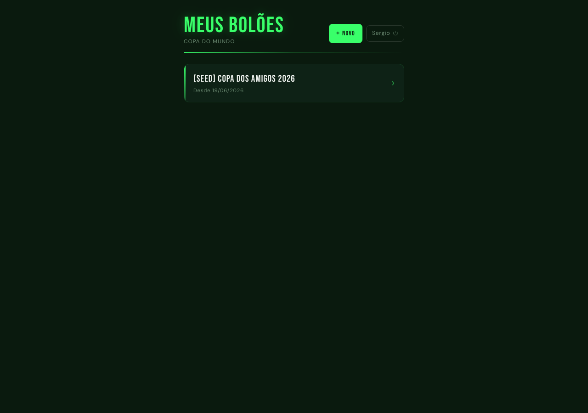

### Jogos e palpites (com banner ao vivo)
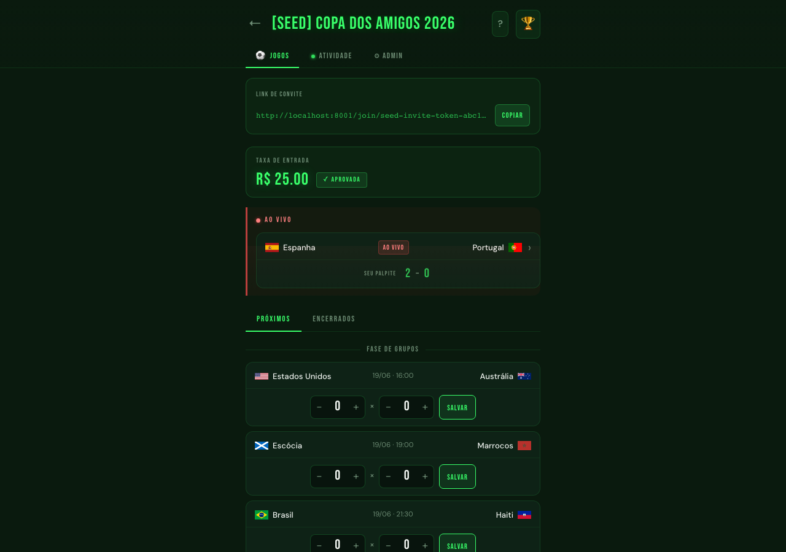

### Ranking
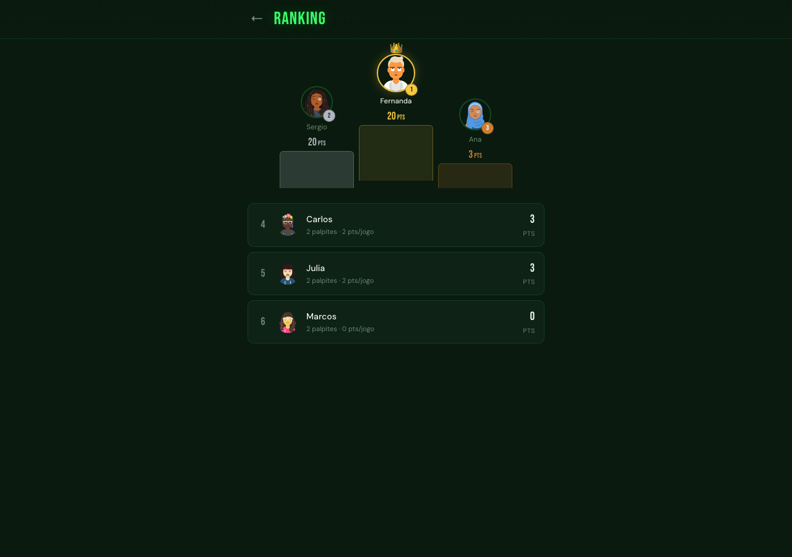

### Feed de atividade
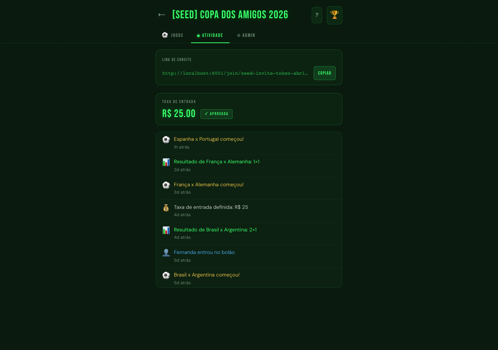

### Painel admin — taxa, retroativos e WhatsApp
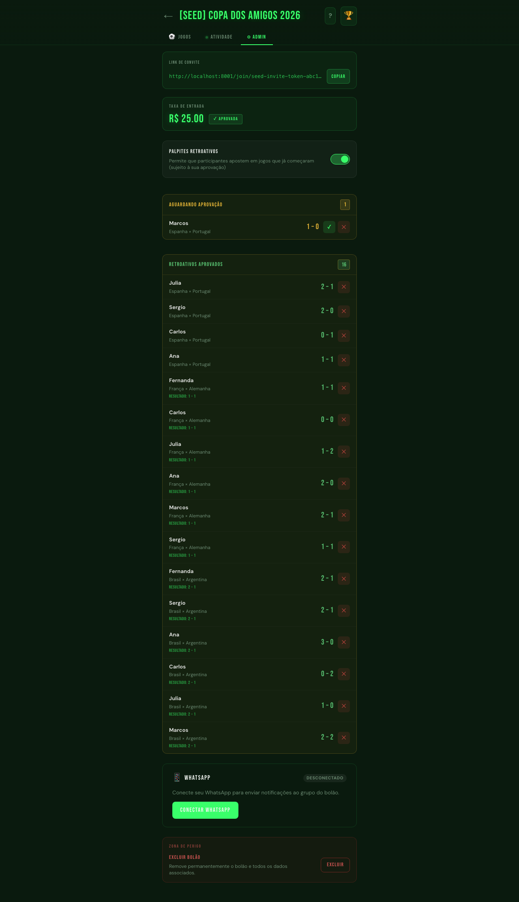

### Palpite retroativo aguardando aprovação
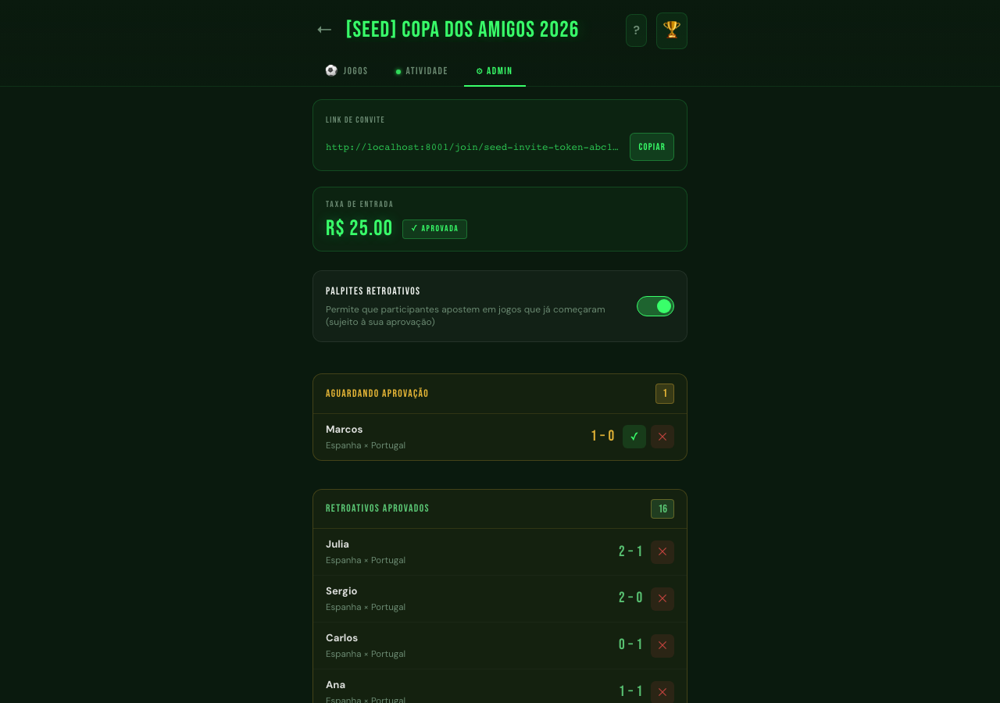

### Notificações WhatsApp
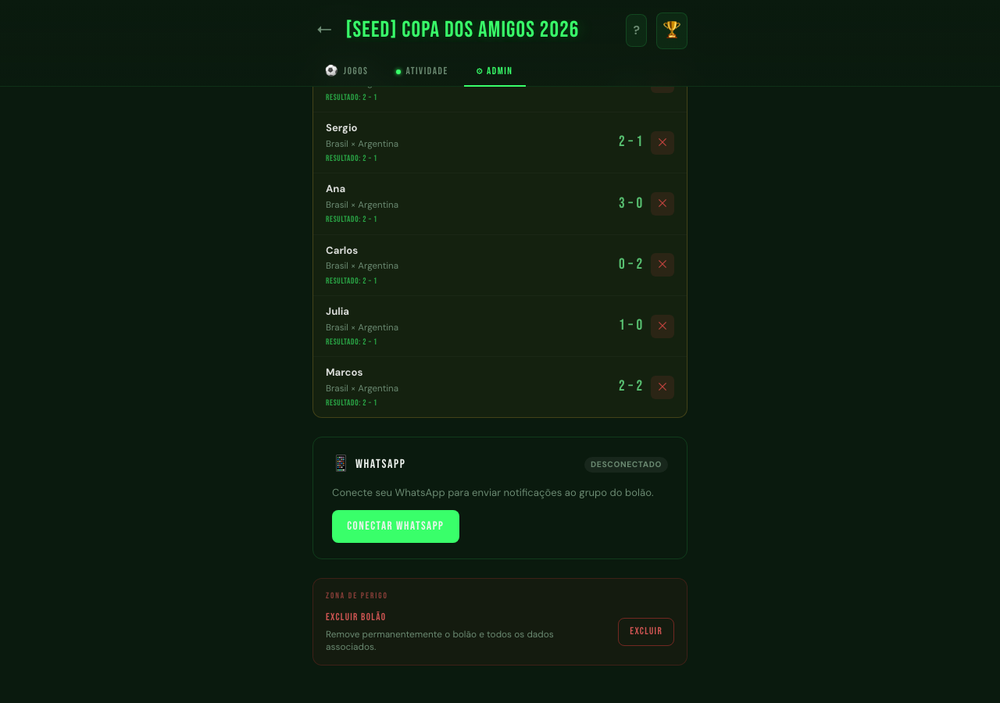

### Excluir bolão
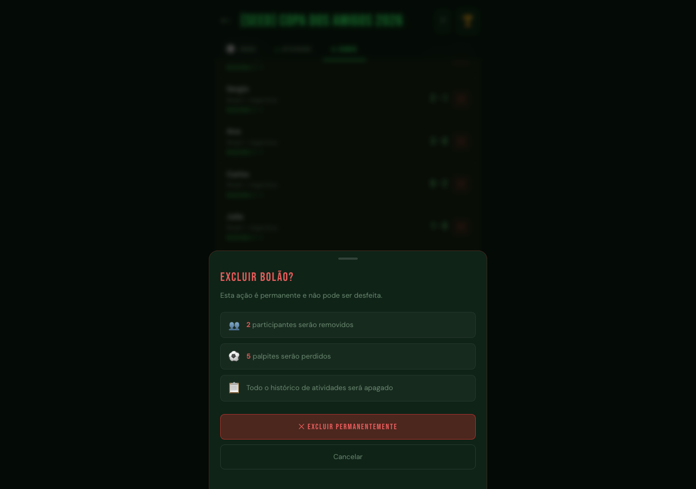

### Como funciona
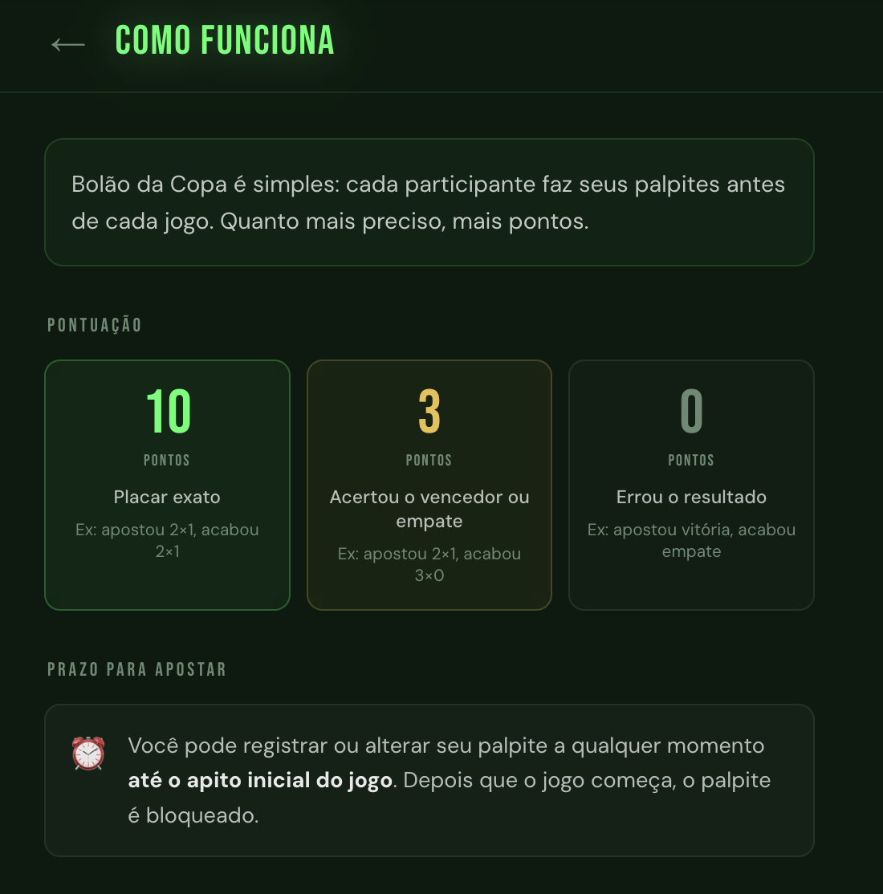
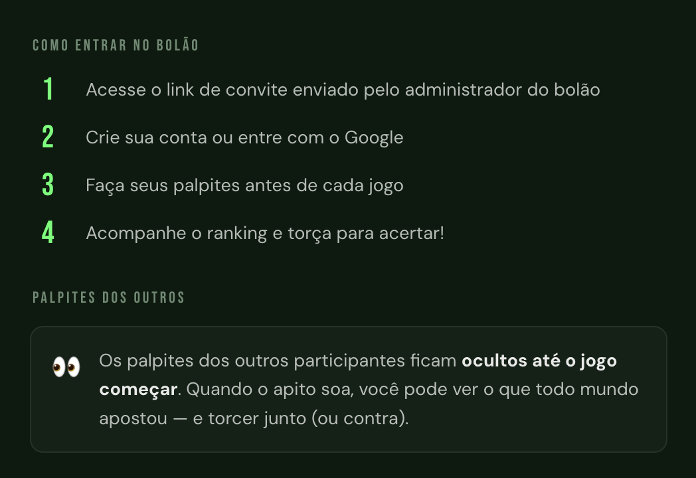

---

## Stack

**Backend** — Go 1.25 · Chi · sqlc · pgx/v5 · golang-migrate · JWT · Google OAuth

**Frontend** — Vue 3 · Vite · TypeScript · Pinia · PrimeVue 4 · Tailwind CSS 4

**Infra** — PostgreSQL 16 · Docker Compose · Nginx · Cloudflare Tunnel

**WhatsApp** — whatsmeow (serviço standalone chamado pelo backend)

---

## Arquitetura

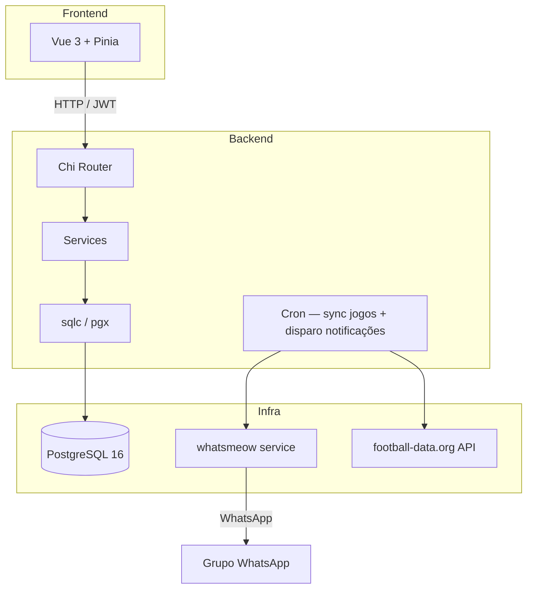

---

## Funcionalidades

- **Bolões** — crie quantos quiser, cada um com link de convite único; o criador é o Administrador
- **Auth** — Google OAuth ou e-mail/senha
- **Palpites** — registre e altere até o apito inicial; bloqueio automático por horário (UTC)
- **Palpite Retroativo** — quando habilitado pelo Administrador, permite registrar palpites após o início do Jogo; ficam pendentes até aprovação explícita do Admin e ocultos dos demais Participantes até lá
- **Ranking** — classificação em tempo real com pontuação acumulada por Bolão
- **Feed** — últimos 50 eventos do bolão com polling de 15s; palpites ficam ocultos até o jogo começar
- **Palpites dos outros** — expanda qualquer jogo já iniciado para ver o que cada participante apostou
- **Jogos ao vivo** — banner fixo no topo da aba Jogos; filtros separados para Próximos e Encerrados
- **Taxa de Entrada** — Administrador propõe um valor; exige aprovação unânime dos Participantes presentes; imutável após definida; sistema não processa pagamentos
- **Excluir bolão** — Administrador pode excluir o bolão com confirmação via drawer
- **Notificações WhatsApp** — vincula um Grupo WhatsApp ao Bolão; três tipos de notificação automática: aviso 10 min antes, partida iniciando, e fim de jogo com pontuações; Administrador pode pausar/retomar
- **Sincronização de jogos** — partidas importadas da [football-data.org](https://www.football-data.org/) via cron

---

## Estrutura do repositório

```
.
├── backend/
│   ├── cmd/api/          # entrypoint
│   ├── internal/
│   │   ├── db/migrations/
│   │   ├── handler/      # HTTP handlers (Chi)
│   │   ├── repository/   # sqlc + manual queries
│   │   └── service/      # regras de negócio
│   └── Dockerfile
├── frontend/
│   ├── src/
│   │   ├── api/          # chamadas HTTP
│   │   ├── components/   # componentes Vue
│   │   ├── stores/       # Pinia
│   │   ├── utils/        # helpers (ex: tradução de nomes de times)
│   │   └── views/        # páginas
│   └── Dockerfile
├── nginx/
│   └── nginx.conf
└── docker-compose.yml
```

---

## Rodando localmente

### Pré-requisitos

- Docker + Docker Compose
- Conta no [football-data.org](https://www.football-data.org/) para a API key (plano gratuito basta)
- Credenciais OAuth do Google ([console.cloud.google.com](https://console.cloud.google.com/))

### 1. Variáveis de ambiente

Copie o exemplo e preencha:

```bash
cp .env.example .env
```

| Variável | Descrição |
|---|---|
| `POSTGRES_DB` | Nome do banco |
| `POSTGRES_USER` | Usuário do banco |
| `POSTGRES_PASSWORD` | Senha do banco |
| `JWT_SECRET` | String aleatória longa para assinar tokens |
| `GOOGLE_CLIENT_ID` | Client ID do OAuth Google |
| `GOOGLE_CLIENT_SECRET` | Client Secret do OAuth Google |
| `GOOGLE_REDIRECT_URL` | URL de callback OAuth (ex: `http://localhost:8001/api/v1/auth/google/callback`) |
| `FOOTBALL_DATA_API_KEY` | Chave da API football-data.org |
| `ALLOWED_ORIGINS` | Origens CORS permitidas (ex: `http://localhost:5173`) |
| `CLOUDFLARE_TUNNEL_TOKEN` | Só necessário em produção com o profile `production` |

### 2. Subir

```bash
docker compose up -d --build
```

O backend roda em `localhost:8080`, o frontend em `localhost:5173` (dev) ou servido pelo Nginx em `localhost:8001`.

As migrations rodam automaticamente na inicialização do backend (`RUN_MIGRATIONS=true`).

### 3. Sincronizar jogos

Com o container rodando, dispare a sincronização manualmente:

```bash
curl -X POST http://localhost:8080/api/v1/admin/sync-jogos \
  -H "Authorization: Bearer <seu-jwt>"
```

Em produção, um cron interno sincroniza periodicamente.

---

## Deploy em produção

O `docker-compose.yml` tem um profile `production` que ativa o Cloudflare Tunnel:

```bash
docker compose --profile production up -d --build
```

Configure um túnel no [Cloudflare Zero Trust](https://one.dash.cloudflare.com/) apontando para `http://localhost:8001` e coloque o token em `CLOUDFLARE_TUNNEL_TOKEN`.

---

## Glossário

Consulte [`CONTEXT.md`](CONTEXT.md) para definições precisas dos termos do domínio (Bolão, Participante, Palpite, Ranking, Feed, etc.).
